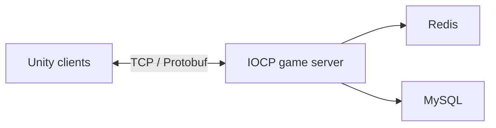

# Smash Kids

**Smash Kids** is a 2D top-down shooting game where players smash through waves of enemies and compete to reach the highest score.

This repository contains the authoritative game server. It is built in modern C++ on top of Windows I/O Completion Ports (IOCP) to support asynchronous, high-performance multiplayer networking. The game client is planned to be developed with Unity.

## Game Overview

- **Genre:** 2D top-down shooter
- **Objective:** Defeat enemies, survive, and reach the highest score
- **Client:** Unity *(planned)*
- **Server model:** Authoritative multiplayer server

## Server Architecture

The server owns the canonical game state and validates player actions. Clients send player input to the server, and the server processes the input before broadcasting authoritative results.



Redis and MySQL integration is planned as the persistence and data layer evolves.

## Tech Stack

| Area | Technology |
| --- | --- |
| Language | C++20 |
| Networking | Winsock2, IOCP, TCP |
| Serialization | Protocol Buffers |
| Build system | CMake |
| Package management | vcpkg |
| Cache / real-time data | Redis *(planned)* |
| Persistent storage | MySQL *(planned)* |
| Game client | Unity *(planned)* |

## Repository Structure

```text
smashkids-server/
├── server/             # Authoritative IOCP game server
│   ├── proto/          # Protocol Buffer message definitions
│   └── src/            # Server, session, packet, and user logic
├── mockclient/         # TCP client for local server testing
├── CMakeLists.txt      # Root CMake configuration
├── CMakePresets.json   # Debug and release build presets
└── vcpkg.json          # C++ dependencies
```

## Getting Started

### Prerequisites

- Windows 10 or later
- A C++20-compatible compiler, such as Visual Studio 2022 with the **Desktop development with C++** workload
- [CMake](https://cmake.org/) 3.24 or later
- [vcpkg](https://github.com/microsoft/vcpkg)

Set the `VCPKG_ROOT` environment variable to your vcpkg installation directory before configuring the project.

### Build

From PowerShell at the repository root:

```powershell
cmake --preset debug
cmake --build --preset debug
```

For a release build:

```powershell
cmake --preset release
cmake --build --preset release
```

The mock client is built by default. To build only the server, configure the project with `MOCK_CLIENT` disabled:

```powershell
cmake --preset debug -DMOCK_CLIENT=OFF
cmake --build --preset debug
```

## Running Locally

Start the server first, followed by the mock client. Both currently use TCP port `9000`.

```powershell
.\out\build\debug\server\Debug\smashkids-server.exe
.\out\build\debug\mockclient\Debug\smashkids-mockclient.exe
```

> The exact executable path can vary by CMake generator. With a single-configuration generator, the extra `Debug` directory may not be present.

Type `quit` in the server console to stop the server gracefully. Type `exit` in the mock client to disconnect.

## Roadmap

- Complete the core authoritative game loop
- Add Unity client connectivity
- Expand Protobuf packet definitions
- Add player movement, combat, enemy, and scoring systems
- Integrate Redis for fast-changing session and game data
- Integrate MySQL for persistent player data and leaderboards
- Add matchmaking, rooms, and load testing

## Contributing

Contributions, bug reports, and feature suggestions are welcome. Open an issue or submit a pull request with a clear description of the proposed change.

## License

No license has been selected yet. Until a license is added, all rights are reserved by the project owner.
